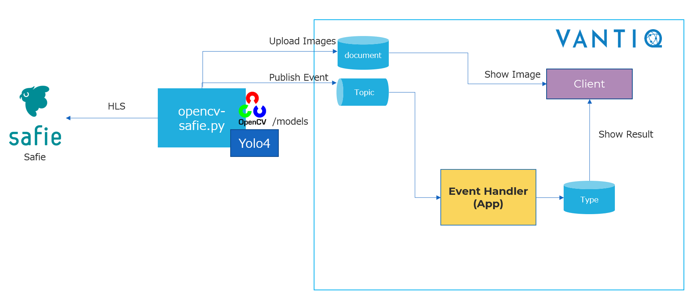
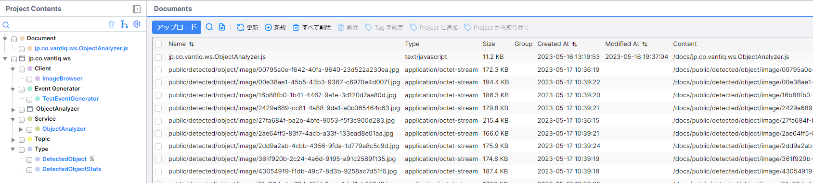

- [概要](#概要)
- [資材説明](#資材説明)
- [事前準備](#事前準備)
  - [Safie Developer](#safie-developer)
  - [Vantiq 環境](#vantiq-環境)
  - [Python実行環境準備](#python実行環境準備)
  - [SafieカメラデバイスID / ステータス取得](#safieカメラデバイスid--ステータス取得)
- [実行手順](#実行手順)
    - [設定ファイルの編集](#設定ファイルの編集)
    - [映像データの送信](#映像データの送信)
    - [実行状況・結果の確認](#実行状況結果の確認)

<br>

# 概要

クラウド監視カメラサービス「Safie」のカメラ映像を取得して映像解析を行い、Vantiqへのデータ連携を実施するサンプルです。

処理の流れは以下の通りです。

1.  Connector (Python スクリプト)で Safieカメラの映像ストリームを取得（HLS）

1.  映像の解析 (Yolo)を実施

1.  映像を解析した結果を Vantiq に連携

1.  Vantiq でストリームを整形、結合、サマリを実施



# 資材説明
「conf」ディレクトリ配下の資材については以下の通りです。
<br>

| 名称 | 種別 | 概要  |
| ---- | ---- | ---- |
| opencv-safie.py | ファイル | 下記処理を行うPythonスクリプトファイル <br>・ HLSによる映像ストリームの取得<br>・ 物体検出アルゴリズムYOLOによる画像解析<br>・ Vantiqへの画像およびJSONデータの送信    |
| requirements.txt | ファイル | Pythonスクリプトファイルの実行に必要なパッケージを記載した設定ファイル  |
| setting.py     | ファイル  | 「opencv-safie.py」で参照するパラメータを記載した設定ファイル  |
| video_stream_sample.zip     | ファイル  | サンプルVantiqプロジェクトファイル<br>※後述のVantiq環境準備にてzipファイル形式のままインポートを行うため、zip展開は不要  |
| files          | フォルダ | Pythonスクリプトで画像を一時保存するための作業用フォルダ  |
| models         | フォルダ | YOLOの学習モデルや設定ファイルを配置  |
<br><br>

# 事前準備

## Safie Developer

このサンプル作成に際しては以下のデバイスを利用しました。
- [Safie One](https://safie.jp/one/)

Safieカメラ登録、設定については以下の手順を確認ください。
- [Safie One スタートページ](https://support.safie.link/hc/ja/articles/4416749420825-Safie-One-%E3%82%B9%E3%82%BF%E3%83%BC%E3%83%88%E3%83%9A%E3%83%BC%E3%82%B8)

APIを利用するには Safie デベロッパー登録が必要です。
- [Safieデベロッパー登録](https://developers.safie.link/tutorial/developers)

Safieデベロッパーでアプリケーションを作成し、APIキーを取得します。 デバイス（カメラ）にアプリケーションを紐付けます。
- [APIキー認証](https://developers.safie.link/tutorial/api-key)


## Vantiq 環境


Vantiqへ映像解析後のデータを送信するため、以下の準備を行います。
<br><br>
-   サンプルプロジェクトのインポート

    任意のNamespaceにて、サンプルプロジェクト「video_stream_sample.zip」をインポートします。

<br>

## Python実行環境準備

-   実行環境OSに合わせ、一般的な方法でPythonをインストール（※）

-   ターミナル/コマンドプロンプトにて、下記コマンドでPythonパッケージを一括インストール

    ```console
    $ cd {"requirements.txt"の配置ディレクトリ}                       
    $ pip install -r requirements.txt                                  
    ```

    ※VSCode等Pythonファイルを実行しやすい開発環境を用意することを推奨
<br><br>
## SafieカメラデバイスID / ステータス取得
デバイス一覧取得API（/v2/devices）を実行し、対象カメラの **"device_id"** の値を取得します。<br>
また、併せて"status"の"video_streaming"が true となっていることを確認します。

https://openapi.safie.link/redoc#tag/Devices-v2/operation/get-v2-devices

- デバイス一覧取得レスポンス例
    ```json
    {
        "total": 1,
        "offset": 0,
        "count": 1,
        "has_next": false,
        "list": [
            {
                "device_id": "XXXXXXXXXXXXXXXXXXXXXXXXXXXXXXXX",
                "serial": "YYYYYYYYYYYYYYYYYYYYYY",
                "setting": {
                    "name": "YYYYYYYYYYYYYYYYYYYYYY"
                },
                "model": {
                    "description": "One (SF-1)"
                },
                "status": {
                    "video_streaming": true
                }
            }
        ]
    }
    ```


<br><br>


# 実行手順

### 設定ファイルの編集

1.  Vantiqのメニュー上部「管理 \> Advanced \>
    AccessTokens」にてトークンを新規作成し、コピーしてテキストエディタ等に控えておきます。

2.  「setting.py」を開き、下記パラメータを変更して保存します。

    ```py
    # LiveStream
    safie_api_key = "{SafieのAPIキー}"
    safie_device_id = "{APIで取得したdevice_id}"
    camera_id = "{カメラ名}"                 
    ```
    ```py
     # VANTIQ Configurations
     ACCESS_TOKEN = "{作成したアクセストークン}"                          
    ```
<br>

### 映像データの送信
<br>

1.  opencv-safie.pyを実行します。
    ※コマンドプロンプト/ターミナルで実行する場合
    
    ```console
    python opencv-safie.py
    ```


<br>

### 実行状況・結果の確認
<br>

-   処理実行中にService「ObjectAnalyzer」を表示すると、受信したイベントの数が赤いバッジで表示されます。
    <br>
    **Info**
    バッジが表示されていない場合はアプリ側でイベントを正常に受信できていないため、設定等の前述の手順を見直してください。\
    

-   実行から一分以上経過すると、「AccumulateState」にてカウントされたデータがTypeに保存されます。
    <br>
    「Project Contents」よりType「DetectedObjectStats」を選択し、画面上部の「すべてのレコードを表示」を選択すると、保存されたレコードが確認できます。
    

-   画像ファイルはDocumentに格納されています。
    <br>
    Project ContentsのDocument配下の「jp.co.vantiq.ws.ObjectAnalyzer.js」をクリックすると、受信した画像ファイルを確認できます。\
    

-   実行中に「Project
    Contents」からClient配下のImageBrowserを表示し、右上の実行ボタンを押下すると、最新の画像および解析後のデータが動的に表示されます。\
    
    

<br>

